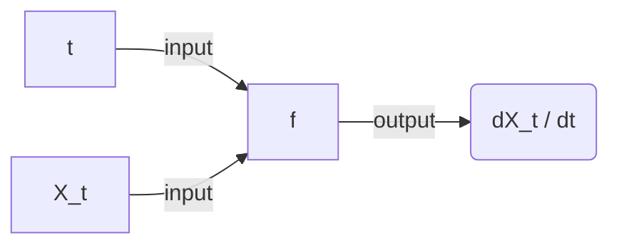
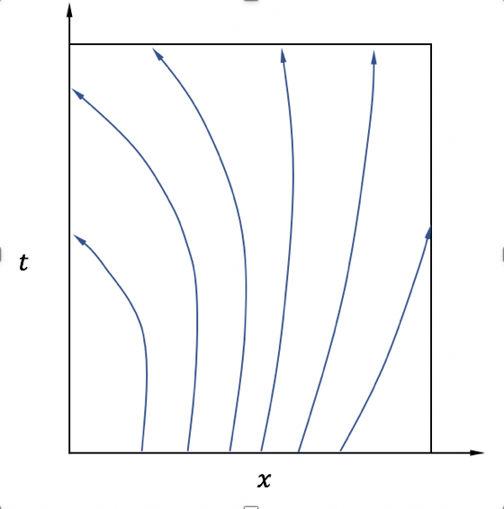
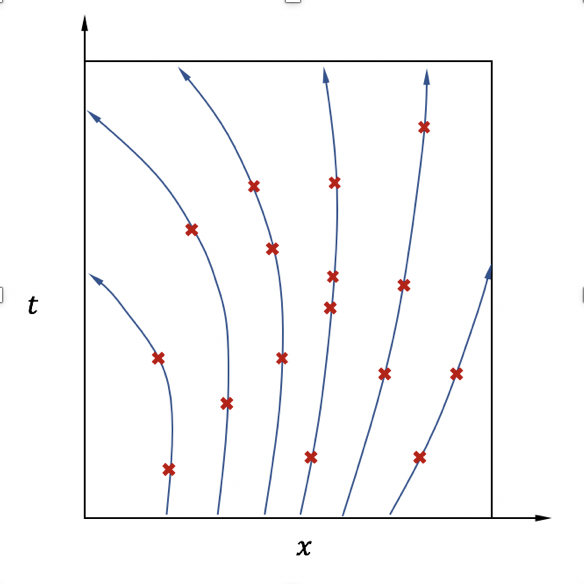
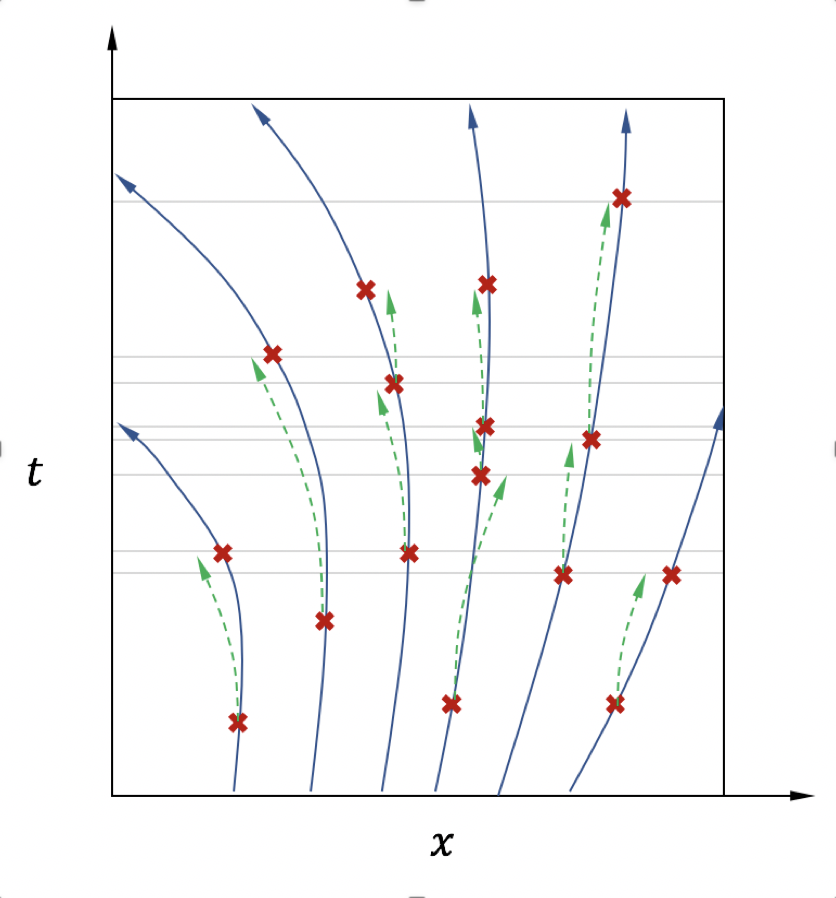
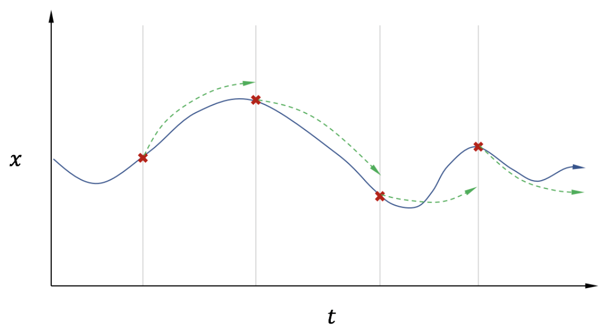

# neural-ODE-model-research
A project aiming for realizing the **ODE Network** proposed by Ricky T. Q. Chen et al. in 2019, and applying it to a chemical reaction model simulation.


### Introduction

ODE Net can find an ode model's inner mechanism by neural network regression. 

Required inputs:[]()

1. Initial values $\{x_{k,t_0}\}$, here $k$ is the label of the $k$-th ode output curve cluster starting from the same initial value, $t_0$ stands for the initial time;
2. Corresponding time records.
3. Discrete observations of the outputs with $K$ labels: $\{x_{0, t_0},x_{0,t_1},...,x_{0,t_{n0}}\},\cdots,\{x_{K, t_0},x_{K,t_1},...,x_{K,t_{nK}}\}$

Inner mechanism:
$$
\frac{{\rm d}X}{{\rm d}t} = f(X)
$$
Where $f$ corresponds to the ODE Net model. It receives *a)* current time $t$ and *b)* current system's state variable values $X_t$ as inputs, and outputs current gradient info $f_t^{'}=f(X_t)$:




**Notes**:

1. In an ODE system, any two curves from the solution trajectory cluster must not intersect with each other. So that each inital value $x_{k,t0}$ leads to a unique solution trajectory curve as shown in the figure below, which ensures the feasibility of the neural network method (in neural network, a single input must produce only one output).

   

2. Usually, we get different discrete solutions originating from different initial states of an ODE system (as shown in the figure below). Since we cannot directly get rate info (like ${{\rm d}X}/{{\rm d}t}$) from the data, it is hard to take the rate info as the training target for the net, whereas the output $X_t$ itself is suitable for fitting a net.

   

   use the ODE Net $f$ to simulate the derivates:
   $$
   f(X_t, t) = {{\rm d}X_t}/{{\rm d}t}
   $$
   by integrating from $t_0$ to $t_1$, then
   $$
   \begin{aligned}
   X(t_1)&=\int_{t_0}^{t_1} \frac{{\rm d}X_t}{{\rm d}t} {\rm d}t \\
   &=\int_{t_0}^{t_1} f(X_t,t) {\rm d}t \\
   &\approx X_{t_0} + \sum_{t_i} f(X_{t_i}, t_i) {\rm d}t, \text{ for $t_i$ in [$t_0,...,t_1 - {\rm d}t$]}
   \end{aligned}
   $$
   Thus, we obtained an integration solver tool to calculate $X_{t_1}$ from $X_{t_0}$:
   $$
   \hat X_{t_1} = ODESolver(X_{t_0}, t_0, t_1, {\rm d}t)
   $$
   i.e.,
   $$
   (X_{t_0}, t_0), f \stackrel{ODESolver}{\longrightarrow} (X_{t_1}, t_1)
   $$
   See the figure:

   

   

3. For simplicity, pick one solution trajectory for the following discussion (shown in the figure below):

   

   define loss:
   $$
   L = loss(ODESolver(X_{t_0},t_0, t_1, f), X_{t_1})
   $$


### CSTR Simulation
  1. Set reaction-relevant device & kinetic params in config/config.yml (see relevant params setting in references/);

  2. Build reaction functions in mod/chemical_reaction/reaction_model.py (see relevant materials in references/);

  3. Run the following codes to generate simulation data from a nonlinear anisothermal CSTR reaction model:

     ```bash
     python lib.run_cstr_simulation.py
     ```

     relevant figures and data are saved in file/ and data/, in which the *total_obs_data.csv* will be used for building the ODE Net model.


### ODE Net Training

1. 


### TODOs:  
  1. ~~Build a nonlinear ODE model for generating samples;~~  
  2. ~~Build the ODE Net for re-constructing the system's manifolds;~~ 
    3. Apply the adjoint sensitivity method instead of back propagation to get derivatives and accelarate the computation;

